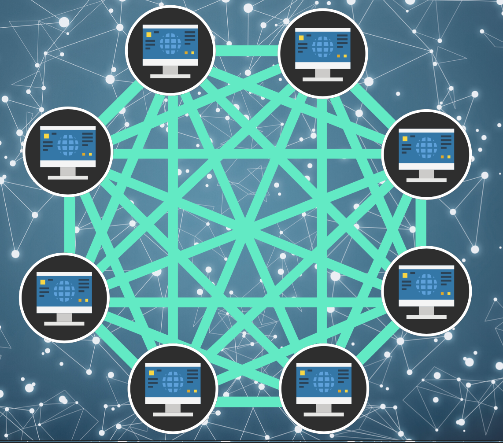
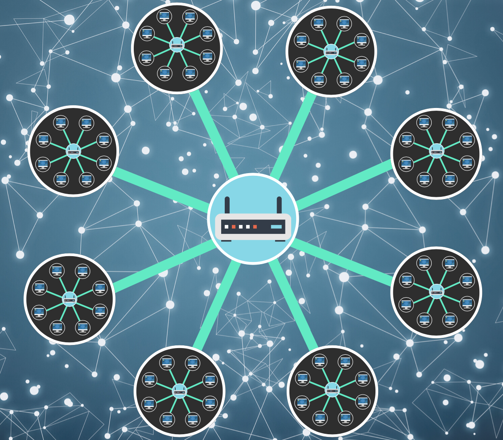

👀 Read more: [How does the Internet work? (MDN)](https://developer.mozilla.org/en-US/docs/Learn/Common_questions/Web_mechanics/How_does_the_Internet_work)

# 1. What is the Internet?

It is just a bunch of computers (all kinds of devices) that connect together 📱-💻-🖥-⌚️.

To connect more and more devices, we cannot use physical cables all the time, so it is the route that comes in:

Now, each computer on a network is connected to a router (a special tiny computer). It is like a railway station, to make sure that a message sent from A arrives at the right destination B.

# 2. So, how to find the destination computer?

Any computer linked to a network has a unique address - "IP address" (Internet Protocol). For example: 192.0.2.172. To make it easier for our humans, we invented the Domain Name System(DNS). For example: google.com == 142.250.190.78.

# 3. Difference between a webpage, website, web server, and search engine?

- **web page**  
  A document which can be displayed in a web browser.

- **website**  
  A website is a collection of linked web pages that share a unique domain name.

- **web server**  
   A computer that hosts a website on the Internet.

- **search engine**  
  A web service that helps you find other web pages.

> Let's imaging:
>
> The library is like a web server, which is similar to a web server hosting multiple websites. The library has several science, math, and history sections, the sections are like websites. One website may have several web pages and web pages can each be found at a unique location (URL).
