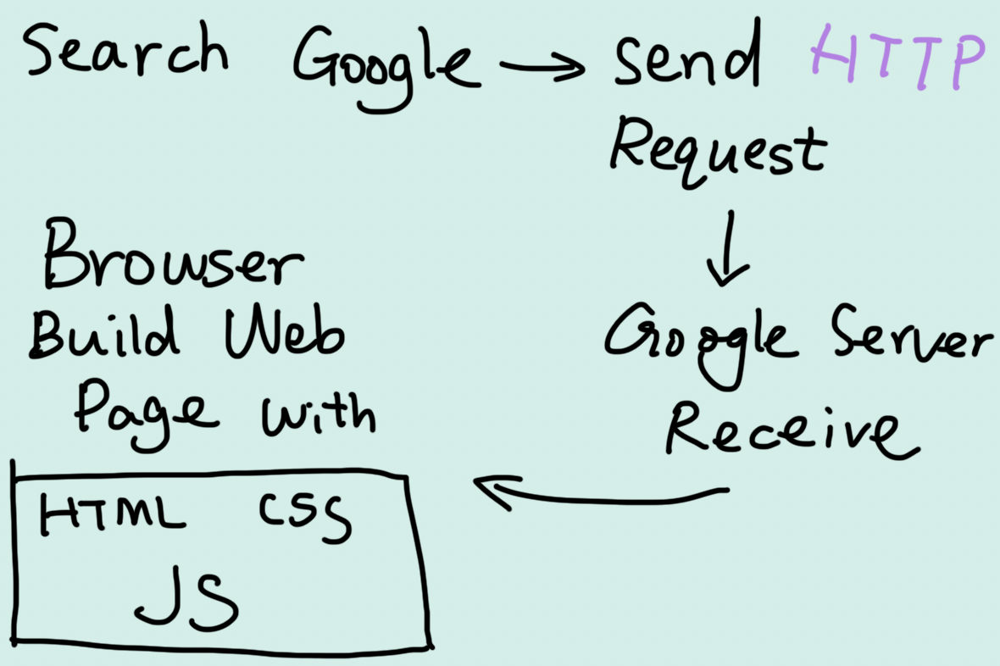

# 1. Internet VS. Web

The Internet is infrastructure while the Web is served on top of that infrastructure. Alternatively, the Internet can be viewed as a big book store while the Web can be viewed as a collection of books on that store. At a high level, we can even think of the Internet as hardware and the Web as software!

 

# 2. How does the Web work?

Computers connected to the internet are called clients and servers.

Clients are your devices connected to Wi-Fi or network and web-accessing software (such as a web browser).

Servers are computers that store webpages, sites, or apps. When a client device wants to access a webpage, a copy of the webpage is downloaded from the server onto the client machine to be displayed in the user's web browser.

So the whole process is like:

 

# 3. HTTP

⭐️ HTTP not only fetch HTML results, it can also be used to fetch parts of documents to update Web pages on demand.

[Read more: Introduction to HTTP ](https://launchschool.com/books/http)
