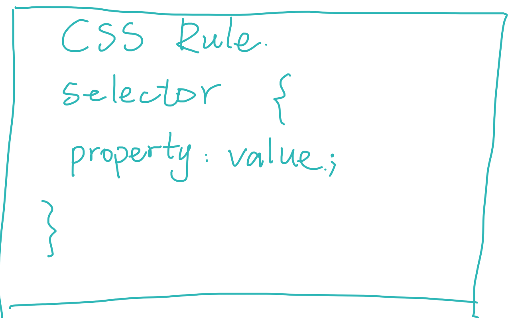

# 💜 CSS Basics:

## 1. Rules

- **Inline Style** (not good idea)
- **style element** (not good idea)
- **style.css external stylesheet** ✅

## 2. Color system

- RGB
- hexadecimal

## 3. Absolute & Relative units

Absolute units is not recommended used for responsive websites.

## 4. CSS Selectors

- universal
- element
- , (select several elements at the same time)
- \# (ID selector)
- . (class selector)
- space descendent selector
- \+ (adjecent)
- \> (direct child)
- input[type="password"] attribute selector
- : pseudo class -- states (checked, active, hover...)
- :: pseudo elements --- specific parts of an element

## 5. Cascade & Specificity

The order in styles matters.

When multiple rules apply to the same element, the more specific selector "wins".

## 6. Inheritance

some elements are inheritable, some are not.

## 7. Box model

### border

- border-width
- border-color
- border-style

looks like 👇

### margin & padding

> `body` has default margin, so we can set to 0 when we start to style the CSS.

## 8. Display property

- display: inline
- display: block
- display: inline-block

change the take up space.

## 9. Relative Units

### percentage

### em

> one problem em can cause:
> 

### rem

 

# 💜 CSS Properties

## 1. alpha channel & opacity

## 2. position

- static
- relative
- absolute (depend on the parent position property)
- fixed
- sticky

## 3. transition

- transition-propert
- transition-duration
- transition-timing-function
- transition-delay

## 4. transform - also applies to its children

- rotate()
- scale()
- translate()
- skew()

> a tip on calculations function:
> 

 

# 💜 responsive

## 1. flexbox

- flex-direction

- justify-content (main axis)
- flex-wrap
- align-items (cross axis)
- align-content (only has effect on flex-wrap)
- align-self
- flex-basis
- flex-grow
- flex-shrink

👇

flex: 1 1 600px // grow, shrink, basis

## 2.responsive: media queries

@media min-width:
