[check html standard here](https://html.spec.whatwg.org/multipage/named-characters.html)

# 1. HTML elements


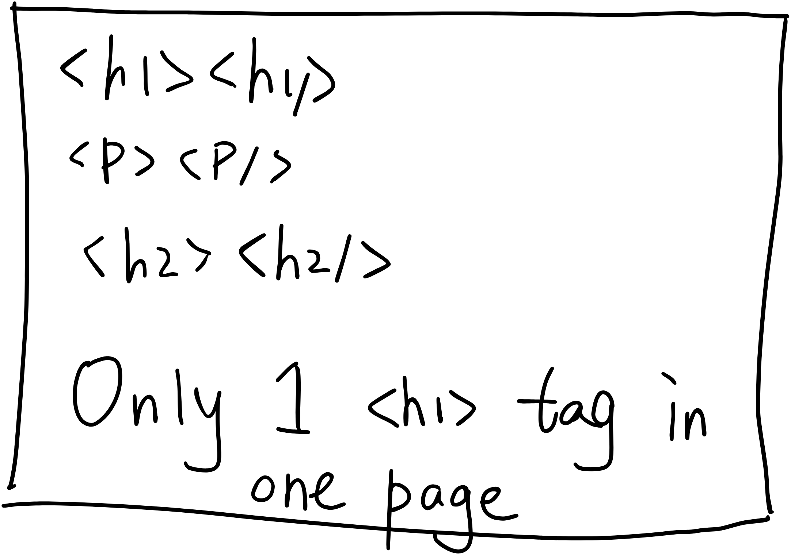

# 2. Inline & Block elements


# 3. HTML entities

Some reserved character  
`&...;`

# 4. Semantic HTML elements

<br>

this kind of tags are more meaningful, more friendly for screenreader and other codes.

📍emmet shortcuts

# 5. table

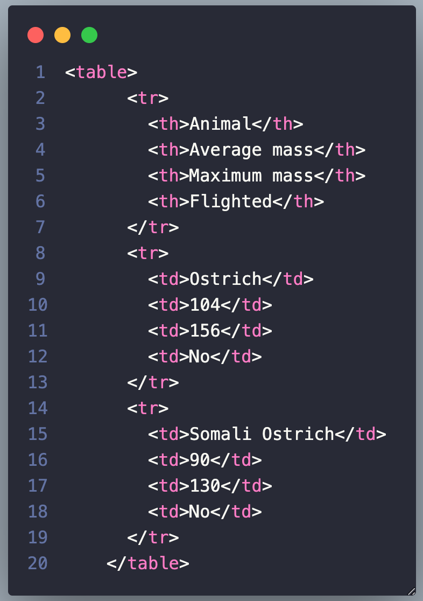

preview on web:

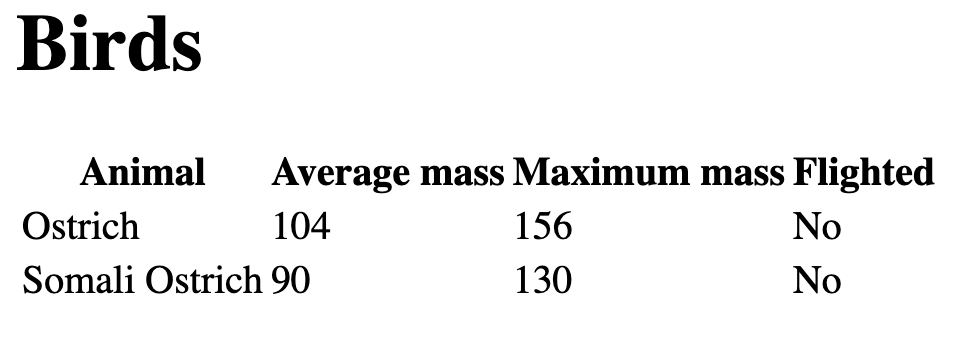

# 6. Form

## action:

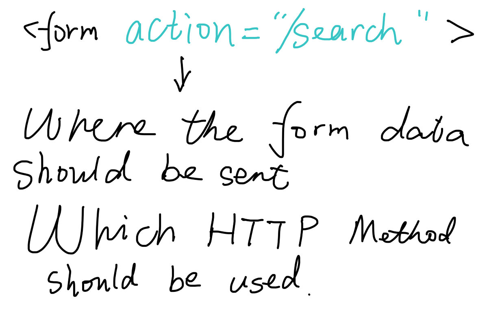

## input:

- difference types
- placeholder

## label:

use the `for=""` to connect the input `id=""`

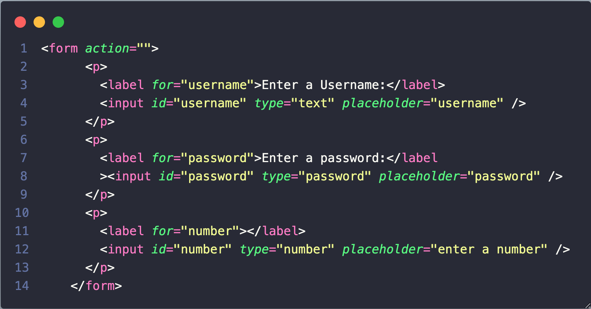

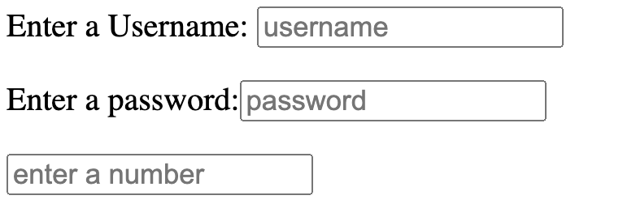

## button:

if we put the button inside of the form, the defualt function is to `Submit`.

## `name` attribute:

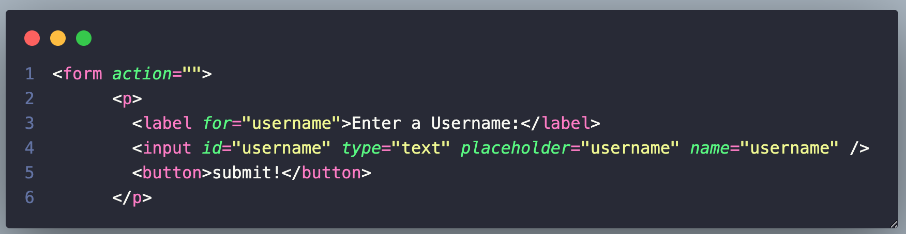

when submit:


## checkbox:

```html
<form action="/birds">
  <input type="checkbox" name="agree_tos" id="agree" />
  <label for="agree">I agree to everything.</label>
  <button>Submit</button>
</form>
```

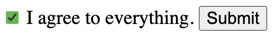

## radio:

to specify which one radio choice, we need `value` attribute in the input:


## select & option:

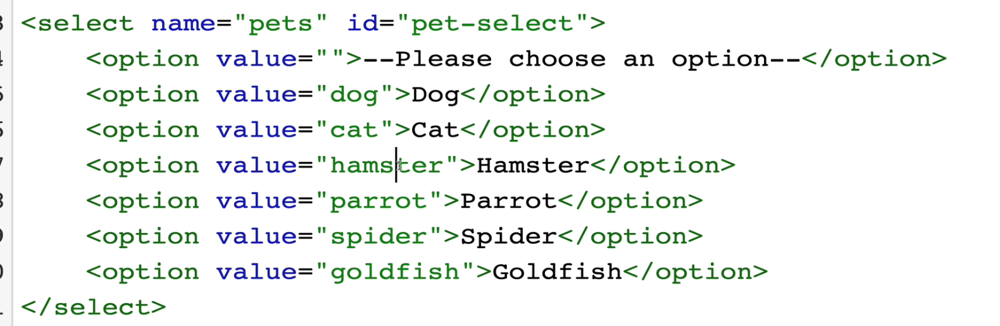

## range:

```html
<form action="">
  <label for="volume">Change the volume</label>
  <input type="range" id="volume" min="1" max="10" name="volume" />
  <button>Submit</button>
</form>
```

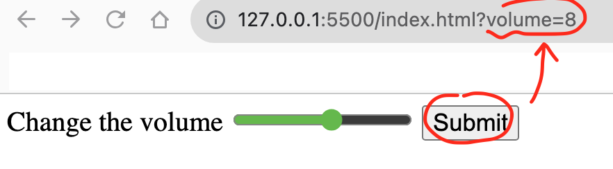

## textarea

## validation

- Required
- minlength
- maxlength

```html
<form action="">
  <label for="firstname">Enter firstname:</label>
  <input type="text" id="firstname" name="firstname" required />
  <button>Submit</button>
</form>
```

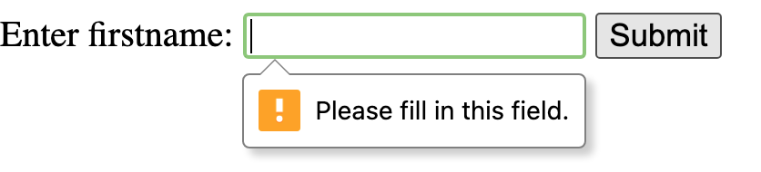
