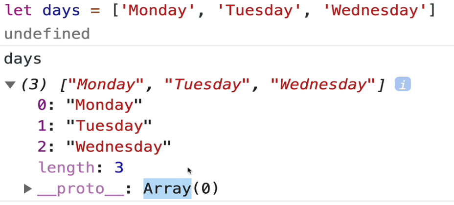
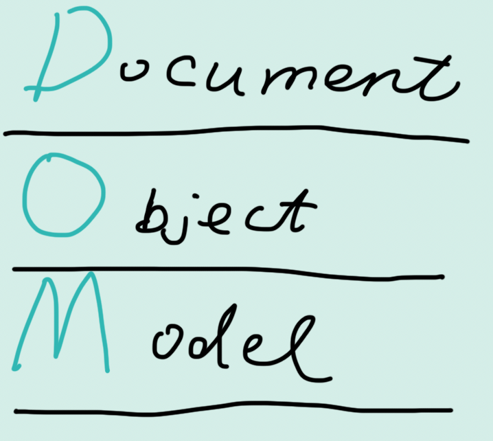
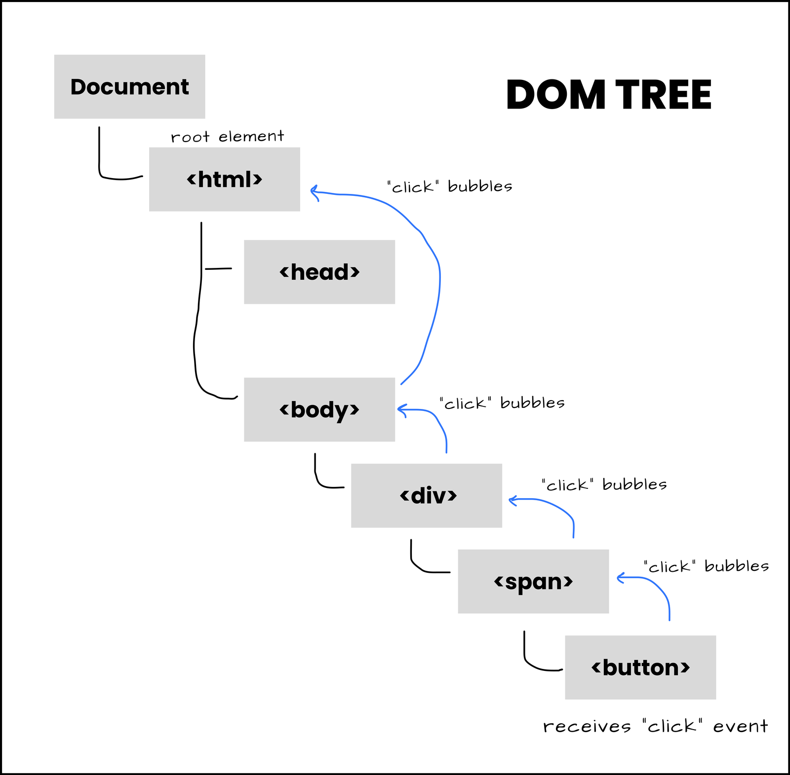

# 💜 JavaScript Basics

> 5 basic types:
>
> 1. number
> 2. string
> 3. boolean
> 4. null
> 5. undefined

## 1. Numbers

in JavaScript, we only have one number type.

`+ - * / % **`

`NaN`

👉 It is number type, but represent sth that is not a number.

```js
0 / 0;
// NaN
typeof NaN;
//number
NaN * 123;
//NaN
```

## 2. Variables

3 ways to create variable:

```js
let variable1 = 2;

const variable2 = 3; // more useful when using array & objects 💜

var variable3 = 3; // we don't use it in new javascript code
```

**increment operator**: `i++` vs. `++i`

```js
let i = 3;
let result = i++;
result; //3

let i = 3;
let result = ++i;
result; //4
```

## 3. Boolean

## 4. string

When adding a string and a number, JS turns the number into a string and smushes them together.

### 🌷 string method()

with a ( ), it is a method, without it is a property, such as `XXXX.length`

```js
let msg = "hello, i am fanpeng";
msg.toUpperCase(); //'HELLO, I AM FANPENG '

let msg = "hello, i am fanpeng          ";
msg.trim(); //'hello, i am fanpeng'
```

`replace()`

`slice()`

`indexOf()`

`repeat()`

### 🌷 template literal

```js
`hello`; //backtick string (it can interpolation)
("hello");
```

## 5. null & undifined

## 6. Math object

```js
Math.round(2.2); //2

Math.round(2.8); //3

Math.PI;

Math.abs(-456); //456

Math.pow(2, 5); //32

Math.floor(3.999); //3
```

### 🌷 Random numbers

```js
Math.random();
```

give a random number between 0 and 1

```js
const step1 = Math.random(); //0.596868984938493

const step2 = step1 * 10; //5.96868984938493

const step3 = Math.floor(step2); //5

const step4 = step3 + 1;
//6
```

we can generate a number between 1 and 10.

<br>

# 💜 Making Decisions with Boolean Logic

## 1. Comparison operators

`> < >= <= == != === !==`

`==` checks for value equality, not types. Which can lead to confusion👇

```js
1 == 1; // true
1 == "1"; // true
0 == " "; // true
null == undefined; // true
```

## 2. `if` statement

- if
- else if
- else

### 🌷 nesting conditions

```js
const password = prompt("Enter a new passoword here:");

if (password.length >= 6) {
  if (password.indexOf(" ") === -1) {
    console.log("Valid password.");
  } else {
    console.log("Password cannot contain space.");
  }
} else {
  console.log("Password is too short.");
}
```

### 🌷 Truthy & Falsy

falsy values:

- false
- 0
- "" empty string
- null
- undefined
- NaN

Everything else is truthy.

### 🌷 Logical Operators

```js
&& //and
|| //or
!  //not
```

```js
// && every side should be true:
const password = prompt("Enter a password here: ");

if (password.length >= 6 && password.indexOf(" ") === -1) {
  console.log("Valid password.");
} else {
  console.log("Incorrect format.");
}
```

```js
// || one side should be true:
const age = prompt("Enter your age: ");

if (age < 5 || age > 65) {
  console.log("Free!");
} else if (age < 10) {
  console.log("$10");
} else if (age < 65) {
  console.log("$20");
}
```

```js
// ! not
!false; //true
!null; //true
```

### 🌷 Switch statement

(not commonly used)

```js
const day = 3;
switch (day) {
  case 1:
    console.log("Monday");
    break;
  case 2:
    cosnole.log("Tuesday");
    break;
  default:
    console.log("I don't know that.");
}
```

<br>

# 💜 Array (data structure)

## 1. Array methods

> `array`: **Ordered** collection of values.

We can see the index here:



### 🌷 `push()` & `pop()`

- `push()` add to the end
- `pop()` remove the end

```js
let movieLine = ["tom", "nancy"];

movieLine.push("oliver"); // ["tom","nancy","oliver"]

movieline.pop(); // ["tom","nancy"]
```

### 🌷 `shift()` & `unshift()`

- `shift()` remove the beginning
- `unshift()` add to the beginning

```js
let movieLine = ["tom", "nancy", "pablo", "oliver"];

movieLine.shift(); // ["nancy", "pablo", "oliver"]

movieLine.unshift("VIP"); // ["VIP", "nancy", "pablo", "oliver"]
```

### 🌷 `concat()` & `includes()` & `reverse()`

```js
let cats = ["dodo", "shadow"];
let dogs = ["orea", "cloud"];
let catAndDog = cats.concat(dogs); //["dodo", "shadow", "orea", "cloud"]
// ⭐️ but the cats and dogs are not changed

cats.includes("dodo"); //true

catAndDog.reverse(); //["cloud", "orea", "shadow", "dodo"]
catAndDog; // ["cloud", "orea", "shadow", "dodo"]
// ⭐️ the reverse() changed the original array
```

### 🌷 `slice()` & `splice()`

`slice()` require the start and the end, but optional

```js
let color = ["red", "blue", "green", "yellow", "purple", "black", "white"];

color.slice(3); // ["yellow", "purple", "black", "white"]

color.slice(2, 4); // ["green", "yellow"]
```

`splice()` require the start, deletecount and items to be added

```js
let color = ["red", "blue", "green", "yellow", "purple", "black", "white"];

color.splice(1, 0, "pink"); //["red", "pink", "blue", "green", "yellow", "purple", "black", "white"]
```

### 🌷 `sort()`

default sort order is ascending, which compare the UTF-16 code.

## 2. Referfencing

```js
[] === []; // false
[1, 2] === [1, 2]; //false
```

why?

> when creating an array, JS allocate the special memory for it, they are distinct. They are not referring to the same thing in memory.

here, num and numCopy are referring to the same array:

```js
let num = [1, 2, 3];
let numCopy = num;
num.push(4);
num; // [1, 2, 3, 4]
numCopy; //[1, 2, 3, 4]
num === numCopy; // true
```

## 3. Array and Const

the arrary points to a place:

```js
const nums = [1, 2, 3];
nums.push(4); //[1, 2, 3, 4]
```

its like : the box stay the same, but the eggs (content) change


<br>

# 💜 Object (data structure)

> objects are collections of properties.
>
> properties are **key-value** pairs.

Create object literals:

```js
const year = {
  1999: "good",
  2000: "bad",
  nextYear: "maybe good",
};

year.1999; // "good"
year["1999"]; // "good"
```

⭐️ Tip: all keys are converted to strings unless they are Symbols.

⭐️ Tip: When Access values: can use dot `.` or `[""]`

<br>

# 💜 Loop

## 1. `for` loop

```js
for (let i = 1; i <= 10; i++) {
  console.log(i);
}
```

loop over array:

```js
const animal = ["cat", "dog", "cow", "bird"];

for (let i = 0; i < animal.length; i++) {
  console.log(animal[i]);
}
```

### 🌷 nested for loop

```js
for (let i = 1; i <= 10; i++) {
  console.log(`i is: ${i}`);
  for (let j = 1; j < 4; j++) {
    console.log(`j is: ${j}`);
  }
}
```

## 2. `while` loop

it is useful when unknown times of loop.

**`break`** keyword:

```js
let input = prompt("Hi, enter somethign: ");
while (true) {
  input = prompt(input);
  if (input.toLowerCase() === "stop copying me") break;
}
console.log("You win.");
```

A number guessing game:

```js
let maximum = parseInt(prompt("Enter a nubmer: ")); //parseInt convert a string num to a number

Math.floor(Math.random() * 10) + 1;
```

## 3. `for...of` loop

A easy way of iterating array or other objects.

```js
let animals = ["cat", "dog", "cow", "rabbit", "pig"];

for (let animal of animals) {
  console.log(animal);
}
```

```js
let name = "lisa";
for (let char of name) {
  console.log(char);
}
```

### 🌷 iterate `object` with `for...in`

```js
const testScores = {
  tom: 80,
  damon: 67,
  kim: 89,
  shawn: 91,
};

for (let person in testScores) {
  console.log(person);
}
// tom, damon...

// it gives us all the keys in the object
```

or we can use `Object.keys(testScores)` to get all the keys, `Object.values(testScores)`, `Object.entries(testScores)`

<br>

# 💜 Functions

## 1. Basics

### 🌷 define & run

> Functions are **Resuable** chunk of code.
>
> 2 steps:
>
> - define the function
> - run it

```js
//define:
function funcName() {
  "do something";
}

funcName(); //run
```

### 🌷 arguments

functions that accept inputs.

```js
// no arguments:
"hello".toUpperCase();

// with arguments:
"hello".indexOf("o");
```

⭐️ Tip: parameter is like the placeholder when define the function, arguments are the actual value we pass into the function when the function is called.

⭐️ Tip: the order of the arguments matters.

### 🌷 Return (built-in method)

- `return` can store values.
- `return` ends functions execution

## 2. More about Functions

### 🌷 function scope

> means variable visibility

```js
let totalEggs = 0;
function collectEggs() {
  totalEggs = 6;
}
console.log(totalEggs); // 0
collectEggs();
console.log(totalEggs); // 6
```

### 🌷 block scope

```js
let radius = 8;
if (radius > 0) {
  const PI = 3.14159;
  let msg = "Hi";
}

console.log(radius); // 8
console.log(msg); // not defined error
```

```js
for (let i = 0; i < 5; i++) {
  let msg = "asdfasdf";
}
console.log(msg); // not defined error
```

### 🌷 lexical scope

child function has access to the parent function variable.

but, parent function does not have access to the variable from child function.

```js
function bankRob() {
  const heroes = ["spiderman", "batwoman", "black panther"];
  function cryForHelp() {
    for (let hero of heroes) {
      console.log(`Please help us: ${hero.toUpperCase()}`);
    }
  }
  cryForHelp();
}
```

### 🌷 function expression

store a no name function in a variable:

```js
const add = function (x, y) {
  return x + y;
};
```

### 🌷 higher order function

1. accept other function as arguments

```js
function callTwice(func) {
  func();
  func();
}

function rollDie() {
  const roll = Math.floor(Math.random() * 6) + 1;
  console.log(roll);
}

callTwice(rollDie); // notice here we are not passing rollDie()
```

2. return a function

### 🌷 define a method

every function is a method

```js
const myMath = {
  PI: 3.14159,
  square: function (num) {
    return num * num;
  },
}; // the function keyword can be omitted: square(num) {return num * num}

myMath.square(3);
```

### 🌷 `this` keyword

1. use `this` to access other property on the same object:

```js
const cat = {
  name: "lily",
  color: "white",
  meow() {
    console.log("this.color"); // white
  },
};
```

2. here, we are actually bonding the `meow2()`to the window object:

```js
const meow2 = cat.meow;
```

### 🌷 try / catch

it prevent the code from crashing:

```js
try {
  hello.toUpperCase();
} catch {
  console.log("error");
}
```

<br>

# 💜 Callback & Array methods

> A callback function is a function passed into another function as an argumen.

## 1. `foreach()` method

```js
const numbers = [1, 2, 3, 4, 5];

numbers.foreach(function (num) {
  console.log(num);
});
```

## 2. `map()` method

**creates a new array** with the results of calling a provided function on **every element** in the calling array.

```js
const numbers = [1, 2, 3, 4, 5];

const double = numbers.map(function (num) {
  return num * 2;
});
```

## 3. arrow function

```js
const add = function (x, y) {
  return x + y;
};

// same as:

const add = (x, y) => {
  return x + y;
};
```

```js
// with single parameter, the () can be omitted
const greet = (x) => {
  return `Hey ${x}!`;
};

// arrow function without a parameter:
const rollDie = () => {
  return Math.floor(Math.random() * 10) + 1;
};
```

### 🌷 implicit return

```js
// if we have only one expressionf or return, we can use implicit return:
const rollDie = () => Math.floor(Math.random() * 6) + 1;
// ⭐️ Tip: if the line is too long, we can use the () for the return value

// for shorter ones, we can put them on one line:
const add = (a, b) => a + b;
```

## 4. `setTimeout` & `setInterval`

```js
console.log("Hello!");
setTimeout(() => console.log("are you still there..."), 3000);
console.log("Goodbye!");

// Hello
// Goodbye
// are you still there...
```

```js
const id = setInterval(() => {
  console.log(Math.random());
}, 2000);
// clearInterval(id)
```

## 5. `filter()` method

**create a new array** with the elements that **pass the test** provided by the function:

```js
const nums = [9, 8, 7, 6, 5];
const odds = nums.filter((n) => {
  return n % 2 === 1; //if true, n is added to the new array
});
// [9, 7, 5]
```

## 6. `.some()` & `.every()` method

boolean method

`some()`: return true if any of the elements pass the test in the function;

`every()`: return true only when all the elements pass the test in the function.

```js
const exams = [76, 55, 87, 79, 90, 68];

exams.every((score) => score > 75); // false

exams.some((score) => score > 75); // true

const allEvens = (numbers) => numbers.every((num) => num % 2 === 0);
```

## 7. `reduce()`

```js
const prices = [91, 23, 55, 32, 20];
let total = 0;
for (let price of prices) {
  total += price;
}

// this is equal to:👇

const prices = [91, 23, 55, 32, 20];
const sumPrice = prices.reduce((total, price) => {
  total + price;
});
```

```js
// finding the minimum of the array:
const numbers = [3, 43, 6, 7, 89, 9];

const minNum = numbers.reduce((min, num) => {
  if (num < min) {
    return num;
  }
  return min;
});
```

```js
// reduce() can have a second argument:
const numbers = [2, 4, 6, 8];
numbers.reduce((sum, num) => sum + num, 100); // here, we added 100 to it
// 120
```

## 8. arrow function & `this`

⭐️ **confusing here**:

```js
const person = {
  firstName: "tom",
  lastName: "jackson",
  fullName: function () {
    return `${this.firstName} ${this.lastName}`;
  },
  shoutName: function () {
    setTimeout(() => {
      console.log(this);
      console.log(this.fullName());
    }, 3000);
  },
};
```

<br>

# 💜 New features

## 1. default params

```js
function rollDie(sides = 6) {
  return Math.floor(Math.random() * sides) + 1;
}
```

## 2. spread

### 🌷 spread in function calls

```js
const nums = [12, 2, 4, 5, 7, 87, 45.34, 7, 67];
console.log(...nums); // 12 2 4 5 7 87 45.34 7 67
// we got the nums with spaces

console.log("hello"); // hello
console.log(..."hello"); // h e l l o
```

### 🌷 spread with array literals

```js
const cats = ["Whiskers", "Fluffy", "Mittens", "Oreo"];
const dogs = ["Buddy", "Max", "Daisy", "Charlie"];

const allPets = [...cats, ...dogs];
// ["Whiskers", "Fluffy", "Mittens", "Oreo", "Buddy", "Max", "Daisy", "Charlie"];

const allPets = ["Happy", ...cats, ...dogs]; // ["Happy", "Whiskers", "Fluffy", "Mittens", "Oreo", "Buddy", "Max", "Daisy", "Charlie"]
```

```js
// we can also spread string:
["hello"];
[..."hello"]; // ["h", "e", "l", "l", "o"]
```

### 🌷 spread with object

```js
const cat = { legs: 4, family: "yellow" };
const dog = { isFurry: true, family: "blue" };

const catDog = { ...cat, ...dog }; // {legs: 4, family: 'blue', isFurry: true}
// the two are combined but the order matters

const catDog = { ...cat, ...dog, family: "pink" }; // we can also modify it
// {legs: 4, family: 'pink', isFurry: true}
```

```js
// spread array into object

{...[2,3,4,5]} // {0: 2, 1: 3, 2: 4, 3: 5}
```

## 3. rest params

different with spread, it allows us to pass a variable number of arguments to a function as an array.

```js
function sum(...numbers) {
  let total = 0;
  for (const number of numbers) {
    total += number;
  }
  return total;
}

console.log(sum(1, 2, 3, 4, 5)); // 15
```

## 4. destructuring

### 🌷 with array

```js
const raceResults = ["Eliud", "Feyisa", "Galen"];
const [gold, silver, bronze] = raceResults;
gold; // "Eliud"
silver; // "Feyisa"
bronze; // "Galen"
```

we can also use ...to include others:

```js
const scores = [12312, 24234, 5345, 465345, 37356];
const [gold, silver, bronze, ...everyoneElse] = scores;
// everyoneElse: [465345, 37356]
```

We can also access the value at any index in an array with commas:

```js
const [a, b, , , c] = [1, 2, 3, 4, 5, 6];

console.log(a, b, c); // 1, 2, 5
```

exchange the value:

```js
let a = 8,
  b = 6;

[a, b] = [b, a];
```

### 🌷 with object

we can make variables from the properties:

```js
const person = {
  firstName: "John",
  lastName: "Doe",
  born: 1999,
};

const { firstName, lastName, born } = person;

console.log(firstName); // John
console.log(lastName); // Doe
console.log(born); // 1999
```

we can also rename the variable when assignment:

```js
const person = {
  firstName: "John",
  lastName: "Doe",
  born: 1999,
};

const { born: birthYear } = person;

console.log(birthYear); // 1999
```

Assign Variables from Nested Object:

```js
const user = {
  johnDoe: {
    age: 34,
    email: "johnDoe@freeCodeCamp.com",
  },
};

const {
  johnDoe: { age, email },
} = user;
```

### 🌷 with params

```js
function printFullName({ firstName, lastName }) {
  console.log(`${firstName} ${lastName}`);
}

const person = {
  firstName: "John",
  lastName: "Doe",
};

printFullName(person); // John Doe
```

<br>

# 💜 DOM



## 1. document

The Document serves as an entry point into the web page's content. It represents all the content on the web page.

`console.dir(document)` to see the directory of document.

## 2. select from DOM

### 🌷 `getElementById()`

We are actually selecting the DOM object that with the specific id.

### 🌷 `getElementsByTagName()` & `getElementsByClassName()`

for example, we can get a HTML collection with this:
`document.getElementsByTagName("img")`

### 🌷 `querySelector()` & `querySelectorAll()`

we can use all kinds of selectors here.

## 3. manipulate DOM Elements

### 🌷 `innerHTML` & `textContent` & `innerText`

- `innerHTML` includes `tags`
- `textContent` show all the text
- `innerText` will hide the hidden text

### 🌷 another way of accessing attribute `.getAttribute()`

eg. `XXXXX.getAttribute("id")`

`setAttribute()`:
`XXXXX.setAttribute("href", "http://www.google.com")`

## 4. change style

the Element's style is empty, because it does not contain the CSS from the stylesheet, only contain the inline CSS.

```js
const h1 = document.querySelector("h1");
h1.style.color; // ''  empty

// but we can assign them with style:
h1.style.color = "green";
```

this is not good.

## 5. classList

the better way to change the style is to add `classList`

```js
const h2 = document.querySelector("h2");
h2.classList.add("purple");
h2.classList.toggle("purple");
```

## 6. parentElement & childElement & sibling...

## 7. create new DOM Elements

`.createElement()`

approach 1:

`.appendChild()`

```js
const newImage = document.createElement("img");
newImage.src = "xxxxxxx";
document.body.appendChild(newImage);
```

approach 2:

`append()`

```js
const p = document.querySelector("p");
p.append("i am happyyyy");
```

## 8. `remove()`

```js
const image = document.querySelector("img");
image.remove();
```

<br>

# 💜 DOM Events

## 1. add events

### 🌷 inline events

write directly in HTML:

```html
<button onclick="alert('you clicked me')">Click me</button>
```

neither convinient nor efficient.

### 🌷 property

writing in JS:

```js
const btn = document.querySelector("#v2");
btn.onclick = function () {
  console.log("you clicked me!");
};

document.querySelector("h1").onmouseover = () => {
  alert("you clicked the h1!");
};
// we need a function reference to the event
```

> ⭐️ Cons: can only add one event handler per event element.

### 🌷 addEventListener

better approach of adding event

```js
const btn = document.querySelector("#v3");
btn.addEventListener("click", () => {
  alert("clicked");
});
```

> ⭐️ Pros: It allows you to attach multiple event handlers to the same event on a single element. More flexible.

## 2. event & `this` keyword

```js
const makeRandomColor = () => {
  const r = Math.floor(Math.random() * 255);
  const g = Math.floor(Math.random() * 255);
  const b = Math.floor(Math.random() * 255);
  return `rgb(${r}, ${g}, ${b})`;
};

const buttons = document.querySelectorAll("button");
for (let eachBtn of buttons) {
  eachBtn.addEventListener("click", colorize);
}

const texts = document.querySelectorAll("#text");
for (let text of texts) {
  text.addEventListener("click", colorize);
}

// when a button is clicked, the colorize function is invoked, and "this" inside "colorize" refers to the button element that was clicked.
function colorize() {
  this.style.backgroundColor = makeRandomColor();
}
```

## 3. event object & keyboard event

event object is every event handler automaticlly have.

```js
const input = document.querySelector("input");
input.addEventListener("keydown", function (e) {
  console.log(e.key);
  console.log(e.code);
  //e.key and e.code can be different
});
```

## 4. form events

`submit` is the **_default_** feature of a form:
to send data to where the `action` is. And automaticlly direct to that address.

```html
<form action="/cat"></form>
```

So if we want to stay at the same page when submitting, how to do that?

👉 we can prevent this redirection by using `event.preventDefault` method!

```js
const form = document.querySelector("#catShelterForm");
const input = document.querySelector("#inputName");
form.addEventListener("submit", function (e) {
  e.preventDefault();
  console.log(input.value);
});
```

## 5. input & change events

```js
const input = document.querySelector("input");
input.addEventListener("change", () => {
  console.log(input.value);)
```

The `input` event is fired every time the value of the element changes. This is unlike the change event, which only fires when the value is committed, such as by pressing the enter key or selecting a value from a list of options:

```js
const input = document.querySelector("input");
input.addEventListener("input", () => {
  console.log(input.value);)
```

## 6. event bubbling

bubbling is a default behavior of events on elements.

```html
<div>
  <span>
    <button>Click Me!</button>
  </span>
</div>
```

👆
Due to event bubbling, when the `button` receives a `click` event, `span` and `div` will also receive the event.



event object has a method to do this: `e.stopPropagation()`

```js
const button = document.querySelector("changeButtonColor");
const container = document.querySelector("#container");
button.addEventListener("click", function (e) {
  container.style.backgroundColor = makeRandomColor();
  e.stopPropagation();
});
container.addEventListener("click", function () {
  container.classList.toggle("hide");
});
const makeRandomColor = () => {
  const r = Math.floor(Math.random() * 255);
  const g = Math.floor(Math.random() * 255);
  const b = Math.floor(Math.random() * 255);
  return `rgb(${r}, ${g}, ${b})`;
};
```

## 7. event delegation

based on bubbling.

when we don't have elements on the page at the time, we can add eventListener to the parent element.

```js
//we're using event.target to get the element that was the target of the event (that is, the innermost element).
function random(number) {
  return Math.floor(Math.random() * number);
}

function bgChange() {
  const rndCol = `rgb(${random(255)}, ${random(255)}, ${random(255)})`;
  return rndCol;
}

const container = document.querySelector("#container");

container.addEventListener("click", (event) => {
  event.target.style.backgroundColor = bgChange();
});
```

<br>

# 💜 Async

## 1. Call Stack

Whenever the function is called, it is pushed onto the top of the call stack. The call stack follows the Last In, First Out (LIFO) principle.

When a function completes its execution or returns a value, it's removed from the top of the call stack. The JavaScript engine then goes to the next function in the stack to execute.

So, the last function that was added (the most recently called function) is the first to be executed.

for example, here is a function that calls a square function, and square function that calls a multiply funciton:

```js
const multiply = (x, y) => x * y;
const square = (x) => multiply(x, x);
const isRightTriangle = (a, b, c) => square(a) + square(b) === square(c);
```


we can use developer tool to know the call stack.

## 2. single thread & WebAPIs

JS is single threaded. (one line of code at one time.)

However, Web APIs (Application Programming Interfaces) allow JS to handle asynchronous operations.

```js
// this line is run immediately:
console.log("Sending request to server!");

setTimeout(() => {
  // When use setTimeout in JS, it doesn't block the main thread. Actually, the browser's web API, not JS, handle the `settimeout()` function, after 3 seconds, the browser moves the callback function (the function inside setTimeout) to the callback queue.
  console.log("Here is your data from the server...");
}, 3000);

// This line is run immediately:
console.log("I AM AT THE END OF THE FILE!");
```

## 3. `promise`

structure:

```js
// THE CLEANEST OPTION WITH then/catch
// RETURN A PROMISE FROM .THEN() CALLBACK
fakeRequestPromise("yelp.com/api/coffee/page1")
  .then((data) => {
    console.log("IT WORKED!!!!!! (page1)");
    console.log(data);
    return fakeRequestPromise("yelp.com/api/coffee/page2");
  })
  .then((data) => {
    console.log("IT WORKED!!!!!! (page2)");
    console.log(data);
    return fakeRequestPromise("yelp.com/api/coffee/page3");
  })
  .then((data) => {
    console.log("IT WORKED!!!!!! (page3)");
    console.log(data);
  })
  .catch((err) => {
    console.log("OH NO, A REQUEST FAILED!!!");
    console.log(err);
  });
```

⭐️ how to make promise:

```js
const fakeRequest = (url) => {
  return new Promise((resovle, reject) => {
    const rand = Math.random();
    setTimeout(() => {
      if (rand < 0.7) {
        resovle("Here is the fake data: blahblah");
      }
      reject("request error");
    }, 4000);
  });
};

fakeRequest("/dogs")
  .then((data) => {
    console.log("Done, with request");
    console.log("data is", data);
  })
  .catch((err) => {
    console.log("oh no", err);
  });
```

## 4. level up promise with `async` & `await`

with `async` keyword, the function automaticly returns promise

```js
const sing = async () => {
  return "la la la";
};
sing().then((data)=>{
  console.log("problem resolved with:" data) // problem resolved with: la la la
})
```

`await` replace the `then` keyword

<br>

# 💜 AJAX & APIs

## 1. AJAX/AJAJ

Asynchronous JavaScript and XML/JSON.

It is a technique used in web development to send and receive data from a web server without needing to refresh the entire web page. It allows web pages to update parts of their content dynamically, in the background, without disrupting what you're currently doing on the page.

## 2. API

## 3. JSON

`JSON.parse()`
`JSON.stringify()`

## 4. HTTP

### 🌷 status codes:

- 200 ok
- 400 bad request
- 401 unauthorized
- 404 not found

### 🌷 query strings

eg. different endpoints:

- `/people/` -- get all the people resources
- `/people/:id/` -- get a specific people resource
- `/people/schema/` -- view the JSON schema for this resource


### 🌷 headers

some API needs headers when sending requests.

## 5. fetch API

```js
fetch("https://swapi.dev/api/people1")
  .then((res) => {
    console.log("resovled", res);
    return res.json();
  })
  .then((data) => {
    console.log(data);
  })
  .catch((err) => {
    console.log("error!", err);
  });
```

or with `async` function:

```js
const loadStarWarsPeople = async () => {
  try {
    const res = await fetch("https://swapi.dev/api/people/1/");
    const data = await res.json();
    console.log(data);
    const res2 = await fetch("https://swapi.dev/api/people/2/");
    const data2 = await res2.json();
    console.log(data2);
  } catch (e) {
    console.log("error", e);
  }
};
```

## 6. Axios

a library for making HTTP request

```js
axios
  .get("https://swapi.dev/api/people/1/")
  .then((res) => {
    console.log("response:", res);
  })
  .catch((e) => {
    console.log("error!", e);
  });
```

with `async` function:

```js
const getStarWarsPerson = async () => {
  try {
    const res = await axios.get("https://swapi.dev/api/people/2/");
    console.log(res.data);
  } catch (e) {
    console.log("error!", e);
  }
};

getStarWarsPerson();
```

⭐️ set Headers with axios

```js
const dadJokes = async () => {
  const config = { headers: { Accept: "application/json" } };
  const res = await axios.get("https://icanhazdadjoke.com/", config);
  console.log(res.data.joke);
};
```

<br>

# 💜 Prototype, Class, OOP

`__proto__` contains all the methods defined in the proto object. for example, every array copy has the access to the `push()` method that defined in `Array` prototype.

## 1. constructor function

```js
function Color(r, g, b) {
  this.r = r;
  this.g = g;
  this.b = b;
}
Color.prototype.rgb = function () {
  const { r, g, b } = this;
  return `rgb(${r}$,{g},${b})`;
};
Color.prototype.rgba = function (a = 1.0) {
  const { r, g, b } = this;
  return `rgb(${r}$,{g},${b}),${a}`;
};

const color1 = new Color(34, 65, 222);
```

## 2. class

rewrite the above constructor:

```js
class Color {
  constructor(r, g, b, name) {
    this.r = r;
    this.g = g;
    this.b = b;
    this.name = name;
  }
  // create methods:
  greet() {
    return `Hello from color: ${this.name}`;
  }
}
const color1 = new Color(75, 255, 148, "grass"); // Color {r: 75, g: 255, b: 148, name: 'grass'}
```

## 3. `extend` & `super`

like parent and children:

```js
class Pet {
  constructor(name, age) {
    this.name = name;
    this.age = age;
  }
  eat() {
    return `${this.name} is eating!`;
  }
}

class Cat extends Pet {
  construcor(name, age, livesleft = 9) {
    super(name, age);
    this.livesleft = livesleft;
  }
  meow() {
    return "meow!!!";
  }
}

class Dog extends Pet {
  bark() {
    return "woof!";
  }
}
```

👇

⭐️ both Cat and Dog have access to Pet's methods.

⭐️ if the children also have a same methods, it will executed rather than the parent's one.

⭐️ super: it is like add-on to the parent's constructor.

<br>
<br>
<br>
<br>
<br>
<br>
<br>
<br>
<br>

# 7. JSON built-in object (javascript object notation)

JSON only uses `“”` and it does not support functions. we use JSON when sending data between computers and store data.

here, we converted the object into the JSON format string, and the method will be lost:

```js
const myObject = {
  name: "Fanpeng",
  hobbies: ["reading", "coding", "swimming"],
  hello: function () {
    console.log("hello!");
  },
};

console.log(myObject);
// {
//     name: 'Fanpeng',
//     hobbies: [ 'reading', 'coding', 'swimming' ],
//     hello: [Function: hello]
// }
console.log(myObject.name); // Fanpeng
myObject.hello(); //hello!
console.log(typeof myObject); // object

const sendJSON = JSON.stringify(myObject);
console.log(sendJSON); // {"name":"Fanpeng","hobbies":["reading","coding","swimming"]}
console.log(typeof sendJSON); // string
console.log(sendJSON.name); // undefined
```

convert JSON into JS (we can notice here the method was lost):

```javascript
const receiveJSON = JSON.parse(sendJSON);
console.log(receiveJSON);
//{name: "Fanpeng", hobbies: Array(3)}
console.log(reveiveJSON);
//object
```

# 8. Local storage

all variables are temporary, when refreshing the page, the storage will lost.

Local storage will not clear the variables when refreshing, but **it only support strings:**

# Pseudocode

Here is an algorithm in pseudocode for FizzBuzz problem:

> When a user inputs a number
> Loop from 1 to the entered number
> If the current number is divisible by 3 then print "Fizz"
> If the current number is divisible by 5 then print "Buzz"
> If the current number is divisible by 3 and 5 then print "FizzBuzz"
> Otherwise print the current number
