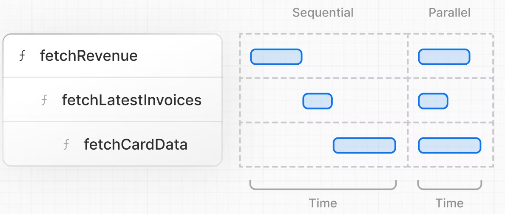

# Next.js

### Index

1. [Rendering](#1-rendering)
2. [Pages](#2-pages-react-components)
3. [Optimize Fonts](#3-optimizing-fonts)
4. [Optimize Images](#4-optimize-images)
5. [Layouts & Pages](#5-layouts--pages)
6. [Optimize Navigation](#6-optimize-navigation)
7. [Database with postgresql](#7-database-with-vercelpostgres)
8. [Fetch Data](#8-fetch-data)
9. [Static and Dynamic Rendering](#9-static-and-dynamic-rendering)

## 1. Rendering

**Client-Side Rendering:**  
In a standard React application, the browser receives an empty HTML shell from the server along with the JavaScript instructions to construct the UI. This is called client-side rendering because the initial rendering work happens on the user's device.  
**Pre-Rendering:**  
Next.js **pre-renders every page** by default. The HTML is generated in advance, on a server, instead of having it all done by JavaScript on the user's device.

💡 When to use Server-side rendering?

- When the data needs to be up-to-date with every request

<br>

## 2. Pages (React components)

In Next.js, a page is a React Component, which is exported from a file in the pages folder.

- `pages/index.js` is associated with the `/` route;
- `pages/posts/first-post.js` is associated with the `/posts/first-post` route.

`Link` Component:

```js
import Link from "next/link";

<h1 className={styles.title}>
  Read <Link href="/posts/first-post">this page!</Link>
</h1>;
```

The Link component enables client-side navigation between two pages in the same Next.js app. Client-side navigation means that the page transition happens using JavaScript, which is faster than the default navigation done by the browser.

## 3. Optimizing Fonts

> when use the next/font module, it downloads fonts at build time and hosts them with other static assets. no additional network requests for fonts which would impact performance.
> [🔗 see docs](https://nextjs.org/learn/dashboard-app/optimizing-fonts-images)

### how to:

1. /app/ui/fonts.ts

```ts
import { Inter } from "next/font/google";

export const inter = Inter({ subsets: ["latin"] });
```

2. /app/layout.tsx

```tsx
<body className={`${inter.className} antialiased`}>{children}</body>
```

3. adding a second font

/app/ui/fonts.ts

```ts
import { Inter, Lusitana } from "next/font/google";

export const inter = Inter({ subsets: ["latin"] });

export const lusitana = Lusitana({
  weight: ["400", "700"],
  subsets: ["latin"],
});
```

/app/page.tsx

```tsx
import { lusitana } from "@/app/ui/fonts";

export default function Page() {
  return (
    <p
      className={`${lusitana.className} text-xl text-gray-800 md:text-3xl md:leading-normal`}
    >
      Happy
    </p>
  );
}
```

## 4. Optimize images

Next.js serve static assets, like images, under `/public` folder.

The `<Image>` Component can automatic optimize images, such as:

- Preventing layout shift when images are loading
- Resizing images in different devices viewport
- Lazy loading by default
- Serving images in modern formats, like WebP and AVIF, when the browser supports

### how to:

🌳 set the width and height to avoid layout shift

```ts
import Image from "next/image";

export default function Page() {
  return (
    <Image
      src="/hero-desktop.png"
      width={1000}
      height={760}
      className="hidden md:block"
      alt="Screenshots"
    />
  );
}
```

- `hidden`: remove the image from the DOM on mobile screens, `md:block`: show the image on desktop screens.

## 5. Layouts & pages


## 6. Optimize Navigation

### how to:

1. `import Link from 'next/link';`
2. `<Link href="…">` instead of using `<a>`

In production, Next.js automatically prefetches the `<Link>` route in the background. Now the browser doesn't reload the whole page, and only the route segments that change re-render.

### Show active Link with `usePathname()` hook:

```tsx
"use client";

import { usePathname } from "next/navigation";

const pathname = usePathname();
```

## 7. Database with @vercel/postgres

https://nextjs.org/learn/dashboard-app/setting-up-your-database

## 8. Fetch data

request waterfall:

In the case of data fetching, each request can only begin once the previous request has returned data.



## 9. Static & Dynamic Rendering

to solve the problem:

- The data requests are creating an unintentional waterfall.
- The dashboard is static, so any data updates will not be reflected on your application.

## 10. streaming

When a user visits a page, their browser sends a request to the server.

Instead of generating the whole page on the server and then sending it all at once, the server starts sending the parts of the page that are ready immediately.

2 ways to implement streaming in Next.js:

- At the page level, with the `loading.tsx` file.
- For specific components, with `<Suspense>`.

### `lodaing.tsx` file:

1. create `loading.tsx` file
2.

```tsx
export default function Loading() {
  return <div>Loading...</div>;
}
```

3. add styles to the loading file

### streaming a component using React Suspense

## 11. Partial Prerendering

## 12. Adding Search and Pagination

search params

## 13. Mutate data

### Server actions
