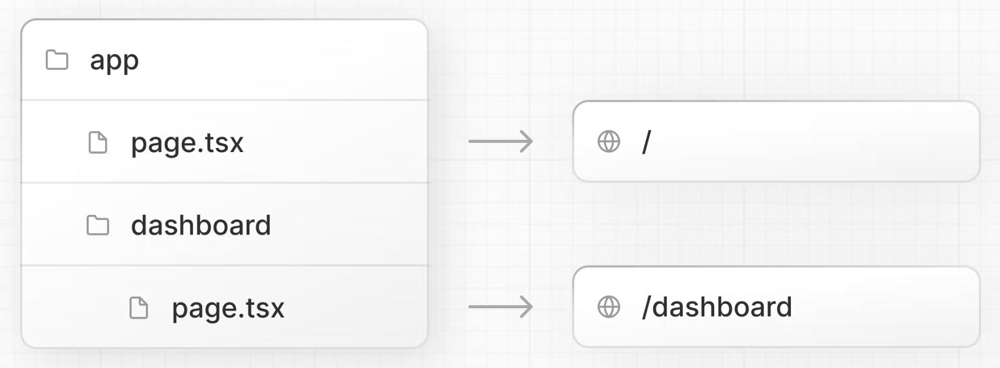

# Next.js

### Index

1. [Rendering](#1-rendering)
2. [Pages](#2-pages-react-components)
3. [Optimize Fonts](#3-optimizing-fonts)
4. [Optimize Images](#4-optimize-images)
5. [Layouts](#5-layouts)

## 1. Rendering

**Client-Side Rendering:**  
In a standard React application, the browser receives an empty HTML shell from the server along with the JavaScript instructions to construct the UI. This is called client-side rendering because the initial rendering work happens on the user's device.  
**Pre-Rendering:**  
Next.js **pre-renders every page** by default. The HTML is generated in advance, on a server, instead of having it all done by JavaScript on the user's device.

💡 When to use Server-side rendering?

- When the data needs to be up-to-date with every request

<br>

## 2. Pages (React components)

In Next.js, a page is a React Component, which is exported from a file in the pages folder.

- `pages/index.js` is associated with the `/` route;
- `pages/posts/first-post.js` is associated with the `/posts/first-post` route.

`Link` Component:

```js
import Link from "next/link";

<h1 className={styles.title}>
  Read <Link href="/posts/first-post">this page!</Link>
</h1>;
```

The Link component enables client-side navigation between two pages in the same Next.js app. Client-side navigation means that the page transition happens using JavaScript, which is faster than the default navigation done by the browser.

## 3. Optimizing Fonts

> when use the next/font module, it downloads fonts at build time and hosts them with other static assets. no additional network requests for fonts which would impact performance.
> [🔗 see docs](https://nextjs.org/learn/dashboard-app/optimizing-fonts-images)

### how to:

1. /app/ui/fonts.ts

```ts
import { Inter } from "next/font/google";

export const inter = Inter({ subsets: ["latin"] });
```

2. /app/layout.tsx

```tsx
<body className={`${inter.className} antialiased`}>{children}</body>
```

3. adding a second font

/app/ui/fonts.ts

```ts
import { Inter, Lusitana } from "next/font/google";

export const inter = Inter({ subsets: ["latin"] });

export const lusitana = Lusitana({
  weight: ["400", "700"],
  subsets: ["latin"],
});
```

/app/page.tsx

```tsx
import { lusitana } from "@/app/ui/fonts";

export default function Page() {
  return (
    <p
      className={`${lusitana.className} text-xl text-gray-800 md:text-3xl md:leading-normal`}
    >
      Happy
    </p>
  );
}
```

## 4. Optimize images

Next.js serve static assets, like images, under `/public` folder.

The `<Image>` Component can automatic optimize images, such as:

- Preventing layout shift when images are loading
- Resizing images in different devices viewport
- Lazy loading by default
- Serving images in modern formats, like WebP and AVIF, when the browser supports

### how to:

🌳 set the width and height to avoid layout shift

```ts
import Image from "next/image";

export default function Page() {
  return (
    <Image
      src="/hero-desktop.png"
      width={1000}
      height={760}
      className="hidden md:block"
      alt="Screenshots"
    />
  );
}
```

- `hidden`: remove the image from the DOM on mobile screens, `md:block`: show the image on desktop screens.

## 5. Layouts & pages


