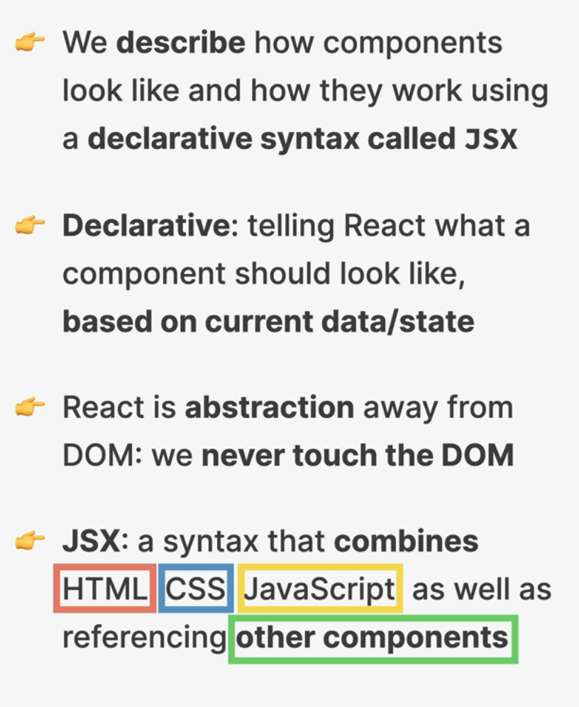
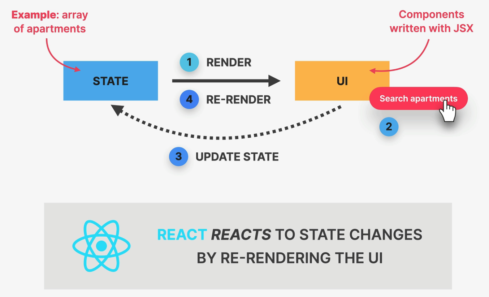

> React is a declarative UI library. JS (imperative) is like telling the cook to "Knit the dough, roll the dough, add tomato sauce, add cheese, add ham, add pineapple, bake at 200 degrees Celsius in a stone oven for...”. But React is like to tell the cook: “A Hawaiian pizza please!”

What is declarative?



<br>

# 1. Components

component tree:


Syntax:

```jsx
function Header() {
  return <h1>i am a header component</h1>;
}

export default Header;
```

One component Can only return one Single Top level element.

<br>

# 2. JSX

use `{}` to add JavaScript logic or reference a dynamic property:

```jsx
function Dog(){
  return <p> {3 + 5}</P>
}
```

# 3. Style in React

- `className` to add class
- same stylesheet name as the component.

⭐️ webpack help us bundle the css with the file

# 4. Props

```jsx
<Greet name="John" />
 <Avatar
      person={{ name: 'Lin Lanying', imageId: '1bX5QH6' }}
      size={100}
    />
```

# 5. conditional logic

```jsx
export default function RollDice() {
  const num1 = Math.floor(Math.random() * 3) + 1;
  const num2 = Math.floor(Math.random() * 3) + 1;

  return (
    <div>
      <h2>Roll the dice</h2>
      // only show the h3 when num1 === num2
      {num1 === num2 && <h3>You win!</h3>}
      <p>Num1: {num1}</p>
      <p>Num1: {num2}</p>
    </div>
  );
}
```

<br>

# 6. maping array

```jsx
export default function Colors({ colors }) {
  return (
    <div>
      <p>Color List</p>
      <ul>
        {colors.map((color) => {
          <li>{color}</li>;
        })}
      </ul>
    </div>
  );
}
```

<br>

# 7. Event

```jsx
function handleClick() {
  console.log("Clicked!");
}

function handleHover() {
  console.log("Hovered!");
}

export default function Clicker() {
  return (
    <div>
      <p onMouseOver={handleHover}>Click the button</p>
      <button onClick={handleClick}>Click</button>
    </div>
  );
}
```

# 8. State



`useState()` returns an array.

```jsx
function HomePage() {
  const [likes, setLikes] = React.useState(0);
}
```

```jsx
export default function Toggler() {
  const [happy, setHappy] = useState(true);
  //  use a function to change the set state:
  function changeFace() {
    setHappy(!happy);
  }

  return (
    <div>
      <h1>{happy ? "😊" : "😢"}</h1>
      <button onClick={changeFace}>Click me</button>
    </div>
  );
}
```

# 9. React lifecycle

To update state based on current/previous value, We use callback functions:

```jsx
export default function Counter() {
  const [count, setCount] = useState(0);
  const addThree = () => {
    setCount((currentCount) => currentCount + 1);
    setCount((currentCount) => currentCount + 1);
    setCount((currentCount) => currentCount + 1);
  };
  return (
    <div>
      <p onClick={addThree}>{count}</p>
    </div>
  );
}
```

# 10. update object & array in state

we cannot direct update object value in the state. Because object/array are mutable, the reference did not change in memory. So, we need to create a copy (we can use spread operator `{...obj}` to copy)

```jsx
export default function ScoreKeeper() {
  const [score, setScores] = useState({ p1Score: 0, p2Score: 0 });
  const addScore1 = () => {
    setScores((oldscore) => ({ ...oldscore, p1Score: oldscore.p1Score + 1 }));
  };
  const addScore2 = () => {
    setScores((oldscore) => ({ ...oldscore, p2Score: oldscore.p2Score + 1 }));
  };
  return (
    <div>
      <h1>Play 1: {score.p1Score}</h1>
      <h1>Play 2: {score.p2Score}</h1>
      <button onClick={addScore1}>Play 1 add 1 Score</button>
      <button onClick={addScore2}>Play 2 add 1 Score</button>
    </div>
  );
}
```

add and delete from array: make copy first, avoid mutate the array

[⭐️ See React Docs](https://react.dev/learn/updating-arrays-in-state)

`filter` & `id`

```jsx
//adding to array:
[...shoppingCart, { id: 4, product: "milk", price: 7.99 }];

//delete an element:
shoppingCart.filter((item) => item.id !== 2);
```

update all element in an array:

`map`

```jsx
shoppingCart.map((item) => ({
  ...item,
  price: item.price * 0.8,
}));
```

change one element in array:

```jsx
shoppingCart.map((item) => {
  if (item.id === 3) {
    return { ...item, price: 5.99 };
  } else {
    return item;
  }
});
```

# 11. state design principle

> Lift state as high as needed. But not higher.
> State cannot pass up.


# 12. useEffect

`useEffect(callbackFunc, [product, userId])`


# 13. material UI
