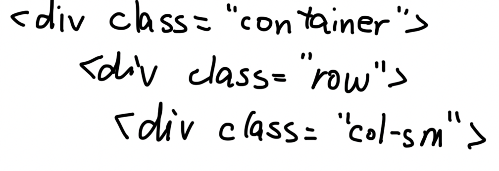
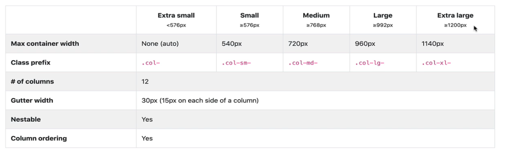
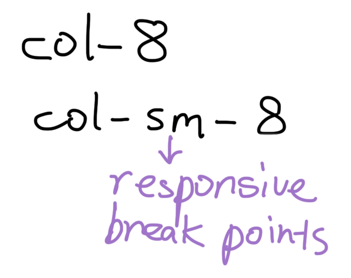

# 1. container

# 2. buttons

# 3. grid

- first, create a `.container`
- second, create a `.row`, every row has 12 units to be divided

grid responsive:

# 4. forms

# 5. navbar

# 6. icon

# 7. card...other utilities
