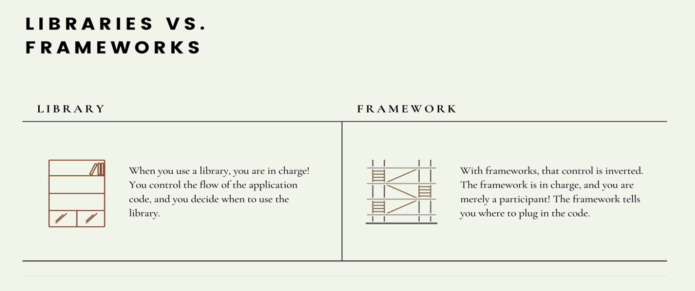
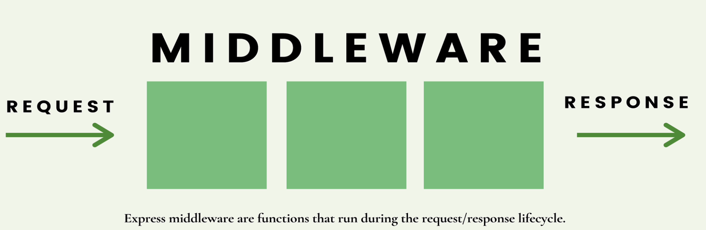
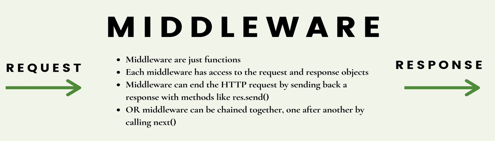

# 💜 Library VS. Framework



# Install

`npm init -y` create basic `package.json`

`npm i express`

<br>

# Request

GET vs. POST


get has word limitation

# Middleware




```js
const express = require("express");
const app = express();

// run on every req:
app.use((req, res, next) => {
  console.dir(req.path);
  next();
});

// only run on /dogs:
app.use("/dogs", (req, res, next) => {
  console.log("i love dogs");
  next();
});

const verifyPassword = (req, res, next) => {
  const { password } = req.query;
  if (password === "chicken") {
    next();
  }
  res.send("sorry you need a password to view the secret");
};

app.get("/", (req, res) => {
  res.send("Home page");
});

app.get("/dogs", (req, res) => {
  res.send("dog page");
});

app.get("/secret", verifyPassword, (req, res) => {
  res.send("my secret is: blah blah blah");
});

app.use((req, res) => {
  res.status(404).send("Not found");
});

app.listen(3000, () => {
  console.log("App is serving on port 3000");
});
```

# error handling

**Define our own error handler:**

like other middleware, but with 4 arguments:

```js
app.use((err, req, res, next) => {
  console.error(err.stack);
  res.status(500).send("Something wrong");
});
```

### 🌷 define error class

```js
class AppError extends Error {
  constructor(message, status) {
    super();
    this.message = message;
    this.status = status;
  }
}

module.exports = AppError;
```
