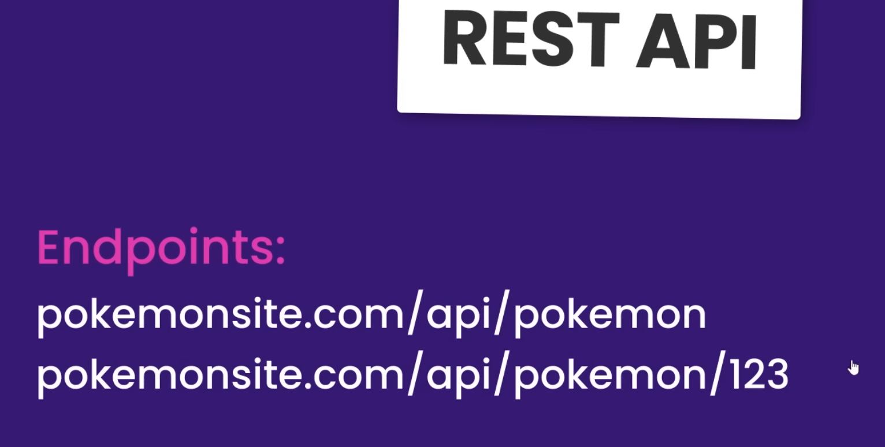
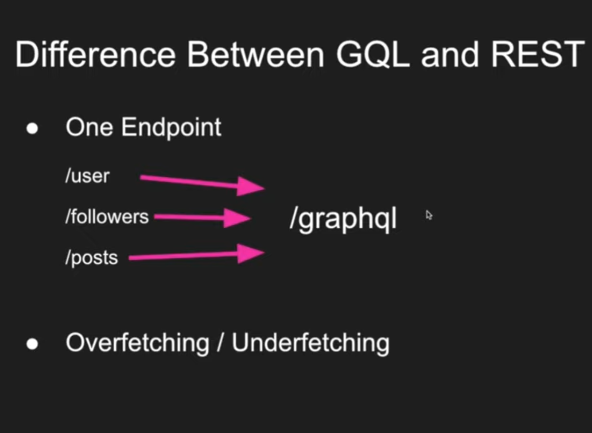

# GraphQL vs REST

### GraphQL is a query language


REST API which can lead to over fetching


GraphQL only gets back the data fields we need.

# 1. Setup a server with Apollo server

https://www.apollographql.com/docs/apollo-server/getting-started/

```bash
npm init --yes && npm pkg set type="module"

npm install @apollo/server graphql
```

# 2. define schema & type

use schema to define the structure of data set that clients can query.

regular object types example:

## query & mutation type

Every GraphQL service has a **query** type and may or may not have a **mutation** type. they are special object because they define the **entry point** of every GraphQL query.

```js
export const typeDefs = `#graphql
  type Game {
    id:ID!
    title:String!
    platform:[String!]!
  } 
  type Review {
    id: ID!
    rating: Int!
    content: String!
  }
  type Author {
    id: ID!
    name: String!
    verified: Boolean!
  }

  type Query {
    Review:[Review]
    Game: [Game]
    Author:[Author]
  }
`;
```

# 3. define a resolver

instruct Apollo Server that it should use that data set when executing a query.
