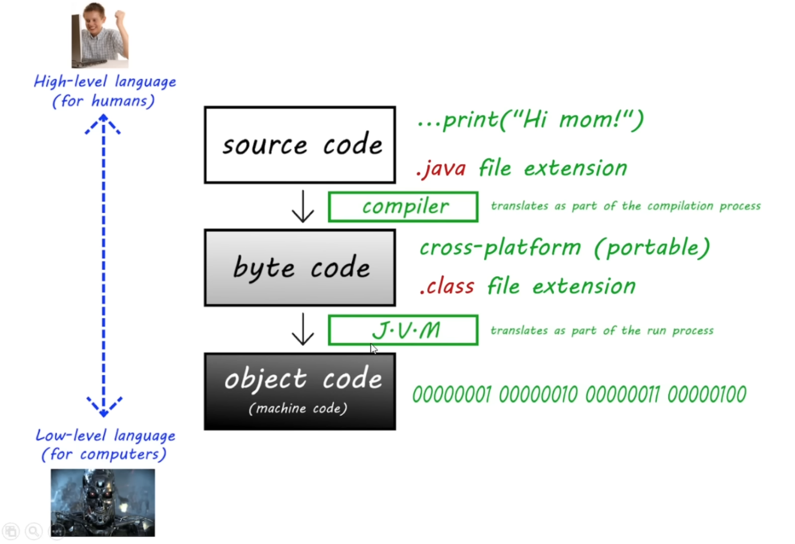
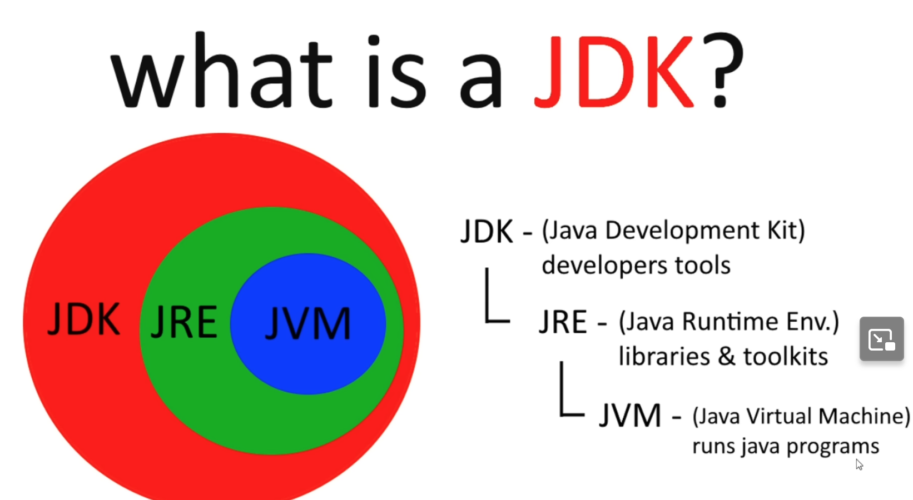
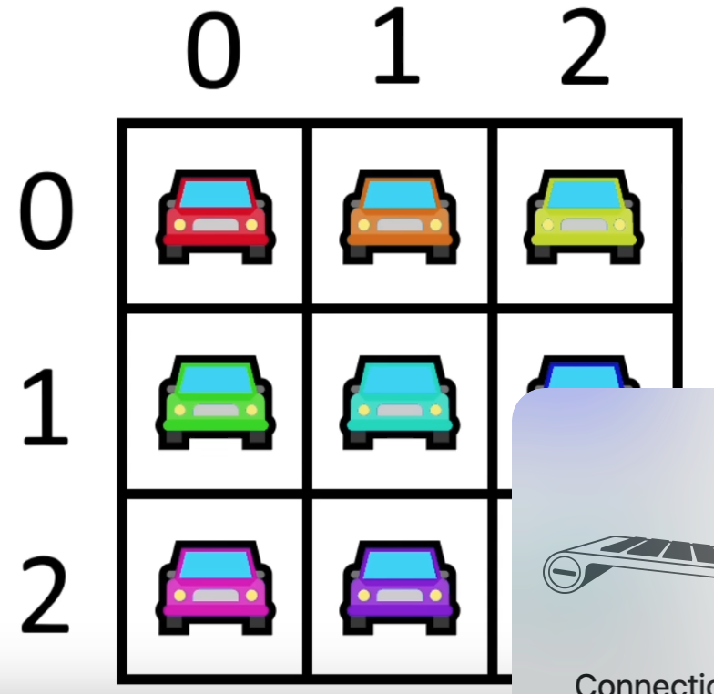

<br>

# variables

```java
import java.util.Scanner;

public class Main {
    public static void main(String[] args) {
        System.out.print("I love ice cream\n");
        int x; //declaration
        int y = 123; // initialization
        System.out.println("my number is: " + y);

        long z = 123123125364747L;

        Scanner scanner = new Scanner(System.in);

        System.out.println("What is your name?");
        String name = scanner.nextLine();
        System.out.println("how old are you?");
        int age = scanner.nextInt();
        scanner.nextLine();
        System.out.println("what is your favorite food?");
        String food = scanner.nextLine();

        System.out.println("hello " + name);
        System.out.println("You are "+age+" years old");
        System.out.println("your favorite food is: "+food);
    }
}
```

# GUI

```java
import javax.swing.JOptionPane;

public class Main {
    public static void main(String[] args) {
        String name = JOptionPane.showInputDialog("Enter your name");
        JOptionPane.showMessageDialog(null, "Hello! " + name);

        int age = Integer.parseInt(JOptionPane.showInputDialog("Enter your age"));
        JOptionPane.showMessageDialog(null, "You are: " + age + " years old");

        double height = Double.parseDouble(JOptionPane.showInputDialog("Enter your height"));
        JOptionPane.showMessageDialog(null, "Your height: " + height + " cm");
    }
}
```

# Math

```java
import javax.swing.JOptionPane;
import java.util.Scanner;

public class Main {
    public static void main(String[] args) {
        double x;
        double y;
        double z;

        Scanner scanner = new Scanner(System.in);

        System.out.println("enter side x: ");
        x = scanner.nextDouble();
        System.out.println("enter side y: ");
        y = scanner.nextDouble();

        z = Math.sqrt(x*x + y*y);
        System.out.println(z);

        scanner.close();
    }
}
```

# Random

```java
import java.util.Random;

public class Main {
    public static void main(String[] args) {
        Random random = new Random();

//        int x = random.nextInt(6)+1;
//        double y = random.nextDouble();

        boolean z = random.nextBoolean();
        System.out.println(z);


    }
}
```

# if statement

```java
public class Main {
    public static void main(String[] args) {

int age = 18;
if(age>=18){
    System.out.println("you are adult");
}
else {
    System.out.println("you are not an adult");
}
    }
}
```

# switches

```java
public class Main {
    public static void main(String[] args) {

        String day = "pizza";

        switch (day) {
            case "Sunday":
                System.out.println("it is sunday");
                break;
            case "Monday":
                System.out.println("it is monday");
                break;
            case "Tuesday":
                System.out.println("it is Tuesday");
                break;
            default:
                System.out.println("that is not a day");
        }
    }
}
```

# logical operators: && || !

```java
public class Main {
    public static void main(String[] args) {

        int temp = 25;

        if(temp>30){
            System.out.println("it is hot outside");
        }
        else if(temp>=20 && temp<=30){
            System.out.println("it is warm outside");
        }
        else {
            System.out.println("it is cold outside");
        }

    }
}
```

```java
import java.util.Scanner;

public class Main {
    public static void main(String[] args) {

        Scanner scanner = new Scanner(System.in);

        System.out.println("you are playing a game! press q or Q to quit");
        String response = scanner.next();

        if (response.equals("q") || response.equals("Q")) {
            System.out.println("you quit the game");
        } else {
            System.out.println("You are still playing the game");
        }
    }
}
```

# while loop

```java
import java.util.Scanner;

public class Main {
    public static void main(String[] args) {

        Scanner scanner = new Scanner(System.in);

        String name = "";

        while(name.isBlank()){
            System.out.print("Please type your name: ");
            name = scanner.nextLine();
        }
        System.out.println("hello "+name);
    }
}
```

the other one is **do while** loop which executes once after check the condition

# for loop

```java
public class Main {
    public static void main(String[] args) {
        // for loop executes code limited times
        for (int i = 0; i <= 10; i++) {
            System.out.println(i);
        }
    }
}
```

# nested loop

```java
import java.util.Scanner;

public class Main {
    public static void main(String[] args) {

        Scanner scanner = new Scanner(System.in);
        int rows;
        int columns;
        String symbol = "";

        System.out.println("Enter # of rows: ");
        rows = scanner.nextInt();
        System.out.println("Enter # of columns: ");
        columns = scanner.nextInt();
        System.out.println("Enter your symbol: ");
        symbol = scanner.next();

        for(int i = 1; i<= rows; i++){
            System.out.println();
            for(int j = 1; j<=columns; j++){
                System.out.print(symbol);
            }
        }
    }
}
```

# array

```java

public class Main {
    public static void main(String[] args) {
        String[] cars = {"Camaro", "Corvette", "Tesla"};
        cars[0] = "Mustang";
        System.out.println(cars[0]);
    }
}
```

or assign the amount of elements first:

```java

public class Main {
    public static void main(String[] args) {
        String[] color = new String[3]; // create 3 elements in the array

        color[0] = "red";
        color[1] = "green";
        color[2] = "blue";

        for(int i = 0; i< color.length; i++){
            System.out.println(color[i]);
        }
    }
}
```

# 2D array



```java

public class Main {
    public static void main(String[] args) {

        String[][] cars = new String[3][3];

        cars[0][0]= "Camaro"; // like rows and columns
        cars[0][1]= "Corvette";
        cars[0][2]= "Silverado";
        cars[1][0]= "DDF";
        cars[1][1]= "fasdfa";
        cars[1][2]= "asgaga";
        cars[2][0]= "qwrwt";
        cars[2][1]= "agagb";
        cars[2][2]= "hgsfdh";

        for(int i=0; i< cars.length; i++){
            System.out.println();
            for(int j= 0; j <cars[i].length; j++){
                System.out.print(cars[i][j]+" ");
            }
        }
    }
}
```

or we can assign like this:

```java
String[][] cars = {
    {"Camaro", "Corvette", "Silverado"},
    {"DDF", "fasdfa", "asgaga"},
    {"qwrwt", "agagb", "hgsfdh"}
};
```

# String methods

```java
    String name = "Bro";

    boolean result = name.equals("Bro");

    int result = name.length();

    char result = name.charAt(0);

    boolean result = name.isEmpty();

    String result = name.toUpperCase();

    String result = name.toUpperCase();

    String result = name.replace("o", "e");

```

# wrapper class

a way to use primitive types as **reference** types, because reference data types contain useful methods, and can be used with collections

primitive--------------wrapper

boolean----------------Boolean

char-------------------Character

int--------------------Integer

double-----------------Double

```java
        // autoboxing
        // unboxing

        Boolean a = true;
        Character b = "@";
        Integer c = 123;
        Double d = 3.14;
        String e = "Bros";
```

# ArrayList

a resizable array, elements can be added and removed after compilation phase. They only store **reference data type**

```java
import java.util.ArrayList;

public class Main {
    public static void main(String[] args) {

        ArrayList<String> food = new ArrayList<String>();

        food.add("pizza");
        food.add("hamburger");
        food.add("hotdog");

        // methods:
        food.set(0, "sushi");
        food.remove(2);
        food.clear();

        for(int i=0; i<food.size(); i++){
            System.out.println(food.get(i));
        }
    }
}
```

# 2D ArrayList

```java
import java.util.ArrayList;

public class Main {
    public static void main(String[] args) {
        ArrayList<ArrayList<String>> groceryList = new ArrayList<>();

        ArrayList<String> bakeryList = new ArrayList<>();
        bakeryList.add("pasta");
        bakeryList.add("garlic bread");
        bakeryList.add("donuts");

        ArrayList<String> vegeList = new ArrayList<>();
        vegeList.add("tomato");
        vegeList.add("carrot");

        groceryList.add(bakeryList);
        groceryList.add(vegeList);
        System.out.println(groceryList);
        System.out.println(groceryList.get(0));
        System.out.println(groceryList.get(0).get(0));
    }
}
```

# for each

iterate elements in an array/collection, less steps than for loop, but less flexible

```java
import java.util.ArrayList;

public class Main {
    public static void main(String[] args) {
//        String[] animals = {"cat", "dog", "rat", "bird"};
        ArrayList<String> animals = new ArrayList<String>();

        animals.add("cat");
        animals.add("dog");
        animals.add("rat");
        animals.add("bird");


        for (String i : animals) {
            System.out.println(i);

        }
    }
}
```

# customize methods

```java
public class Main {
    public static void main(String[] args) {
        String name = "fanpeng";
        hello(name);
    }

   static void hello(String title) {
        System.out.println("hello " + title);
    }

}
```

```java
public class Main {
    public static void main(String[] args) {
        String name = "fanpeng";
        int age = 21;
        hello(name, age);
    }

   static void hello(String title, int age) {
        System.out.println("hello " + title);
       System.out.println("You are " + age );
    }

}
```

```java

public class Main {
    public static void main(String[] args) {
        int x = 3;
        int y = 4;
        System.out.println(add(x, y));
    }

    static int add(int x, int y) {
        return x + y;
    }

}
```

# overloaded methods

methods that have the same name but have different parameters

```java
public class Main {
    public static void main(String[] args) {
        int total = add(1, 3, 5);
        System.out.println(total);
    }

    static int add(int a, int b) {
        System.out.println("this is overloaded method 1");
        return a + b;
    }

    static int add(int a, int b, int c) {
        System.out.println("this is overloaded method 2");
        return a + b + c;
    }

    static int add(int a, int b, int c, int d) {
        System.out.println("this is overloaded method 3");
        return a + b + c + d;
    }
}
```

# printf() method

2 arguments: format string + (object/variable/value)

```java
public class Main {
    public static void main(String[] args) {
        System.out.printf("this is a format string %d", 123); // this is a format string 123
    }
}
```

```java
public class Main {
    public static void main(String[] args) {
        boolean myBoolean = true;
        char myChar = '@';
        String myString = "Fanpeng";
        int myInt = 50;
        double myDouble = 1000;

        System.out.printf("%b 👈here is the result", myBoolean);
        System.out.printf("%c 👈", myChar);

        //can also set width:
        System.out.printf("%10c 👈", myChar);
        //can also set the precision of float and double:
        System.out.printf("%.2f", myDouble);
        // display positive or negetive number:
        System.out.printf("You have this much money: %+f", myDouble);
        // group separator for numbers:

    }
}
```

# final keyword

assign variable cannot be changed later

```java
public class Main {
    public static void main(String[] args) {
        final double PI = 3.14159;
        System.out.println(PI);
    }
}
```

# OOP

```java
public class Car {
    String make = "Chevrolet";
    String model = "Corvette";
    int year = 2023;
    String color = "blue";
    double price = 50000.00;

    void drive(){
        System.out.println("you drive the car");
    }
    void brake(){
        System.out.println("you step on the brakes");
    }
}
```

# constructors

```java
public class Main {
    public static void main(String[] args) {
        Human human1 = new Human("Rick", 65,70);
        System.out.println(human1.age);

        Human human2 = new Human("Lisa", 20, 60);
        System.out.println(human2.name);

        human2.eat();
        human1.drink();
    }
}

import org.w3c.dom.ls.LSOutput;

public class Human {
    String name;
    int age;
    double weight;
    Human(String name, int age, double weight){
        this.name = name;
        this.age = age;
        this.weight = weight;
    }

    // method:
    void eat(){
        System.out.println(this.name+ " is eating");
    }
    void drink(){
        System.out.println(this.name+ " is drinking");
    }
}
```

# local & global

local: declared inside a method,
global: declared outside of a method, but within a class visible to all parts of a class

```java
import java.util.Random;

public class Dice {

    Dice(){
        Random random = new Random();
        int number = 0;
        roll(random, number);
    }
    void roll(Random random, int number){
        number = random.nextInt(6)+1;
        System.out.println(number);
    }
}
```

# overloaded constructor

it allows to create objects in different ways. For example, one constructor might require only one parameter, while another might require two or more.

```java
public class Pizza {
    String bread;
    String sauce;
    String cheese;
    String topping;

    Pizza(String bread, String sauce) {
        this.bread = bread;
        this.sauce = sauce;
    }
    Pizza(String bread, String sauce, String cheese) {
        this.bread = bread;
        this.sauce = sauce;
        this.cheese = cheese;
    }
    Pizza(String bread, String sauce, String cheese, String topping) {
        this.bread = bread;
        this.sauce = sauce;
        this.cheese = cheese;
        this.topping = topping;
    }
}
```

# toString()

```java
public class Main {
    public static void main(String[] args) {

        Car car = new Car();
        System.out.println(car); //Car@30f39991   the address in the memory
    }
}
```

usage: return the string representation of attributes of the object:

```java
public class Main {
    public static void main(String[] args) {

        Car car = new Car();
        System.out.println(car.toString());
    }
}


public class Car {
    String make = "Chevrolet";
    String model = "Corvette";
    int year = 2023;
    String color = "blue";
    double price = 50000.00;

    public String toString() {
        return make + "\n"+model+"\n"+color+"\n"+year;
    }
}
```
