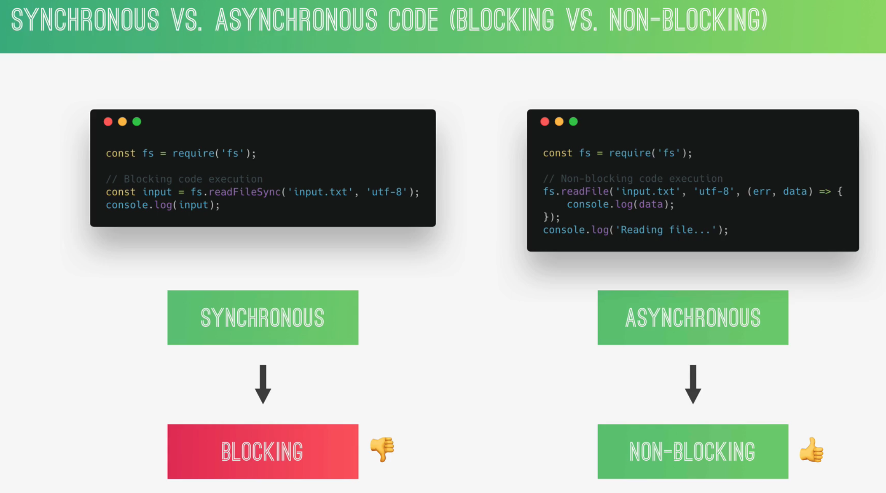

# 1. Intro

JS that runs outside of browser.

We can use the `node` REPL to run code.

`global`

# 2. Module

`exports`

# 3. Require

⭐️ the `import` statement is only allowed in ES modules and cannot be used in embedded scripts without the type="module" attribute.

Also, to use ES modules in Node.js, you must save such modules with an extension of `.mjs`:

```js
// utils.mjs
export const getFullName = (firstname, lastName) => {
  return `my fullname is ${firstname} ${lastName}`;
};

// index.js
import { getFullName } from "./utils.mjs";
console.log(getFullName("John", "Doe")); // My fullname is John Doe
```

# 4. Files

sync way of read files:

```js
const fs = require("fs");

const textIn = fs.readFileSync("./txt/input.txt", "utf-8");
console.log(textIn);
```

write files:

`fs.writeFileSync( file, data, options )`

# 5. synchronous vs. asynchronous



async way of reading file:

```js
fs.readFile("./txt/start.txt", "utf-8", (err, data) => {
  console.log(data);
});
console.log("Will read file"); // this line will run first
```

# 6. HTTP building server

```js
const http = require("http");

const server = http.createServer((req, res) => {
  res.end("Hello from the server");
});

server.listen(3000, () => {
  console.log("listening to requests on port 3000");
});
```

# 7. route

here, we are using basic node to create route:

```js
const path = require("url");
const http = require("http");

const server = http.createServer((req, res) => {
  const pathName = req.url;
  if (pathName === "/" || pathName === "/overview") {
    res.end("Hello from the server");
  } else if (pathName === "/product") {
    res.end("This is the product");
  } else {
    res.end("Page not found");
  }
});

server.listen(3000, () => {
  console.log("listening to requests on port 3000");
});
```
